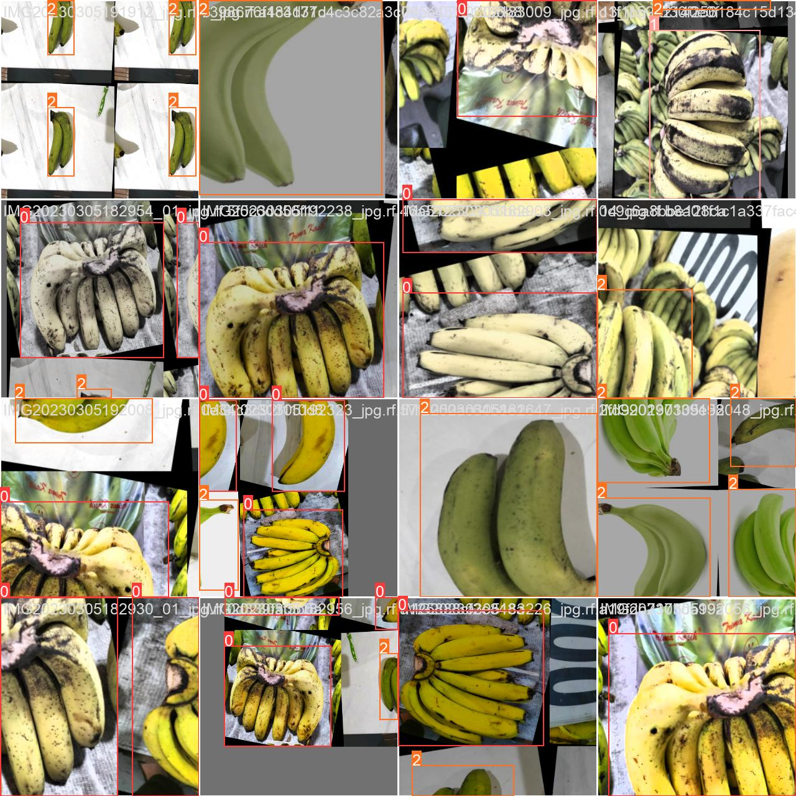

## Suskibirds Project

    
    

# Suskibirds Detector

This is an Android application that detects the freshness of bananas using a deep learning model and computer vision. The model is based on transfer learning with YOLOv8 and has been trained on a custom dataset from Roboflow.

## Download

The application can be downloaded from the following link:

[Download Suskibirds Detector APK](https://drive.google.com/file/d/1nAx90cRNW7uFl48LB5bPSi6P9lzhuodu/view?usp=sharing)

## Features

- Detects the freshness of bananas in real-time using the camera.
- Provides a freshness score to help users make informed decisions.
- Easy-to-use interface with clear instructions.

## Dataset

The dataset was obtained from Roboflow and consists of 837 images with 3 classes. The dataset can be accessed from the following link:

[Roboflow Dataset](https://universe.roboflow.com/banana-7c0fs/banana-euhm9)

## Model Training

The model was trained using transfer learning with YOLOv8 on a custom dataset from Roboflow. Once trained, the custom YOLOv8 model was converted to TensorFlow Lite for deployment on Android.

## Result

  

    
      <train_batch0.jpg>
    "train_batch0" refers to the first batch of training data used in the training phase of a machine learning or deep learning model. It contains the initial subset of the training data, which the model processes to begin updating its parameters and improving performance.
    
          
          

    
    <val_batch0_labels.jpg>
    
  
      

## License

This project is licensed under the MIT License - see the [LICENSE](LICENSE) file for details.

## Acknowledgements

- [YOLOv8](https://github.com/ultralytics/ultralytics) for the object detection framework.
- [Roboflow](https://roboflow.com/) for the custom dataset and tools.
- The contributors who made this project possible.

## Contact

Creator 
1. Murdiyan Edzwan Nazib

Program Studi Teknik Industri Pertanian Universitas Linggabuana PGRI Sukabumi

If you have any questions or suggestions, feel free to open an issue or contact us at [edzwan@unlip.ac.id](mailto:your-email@edzwan@unlip.ac.id).

